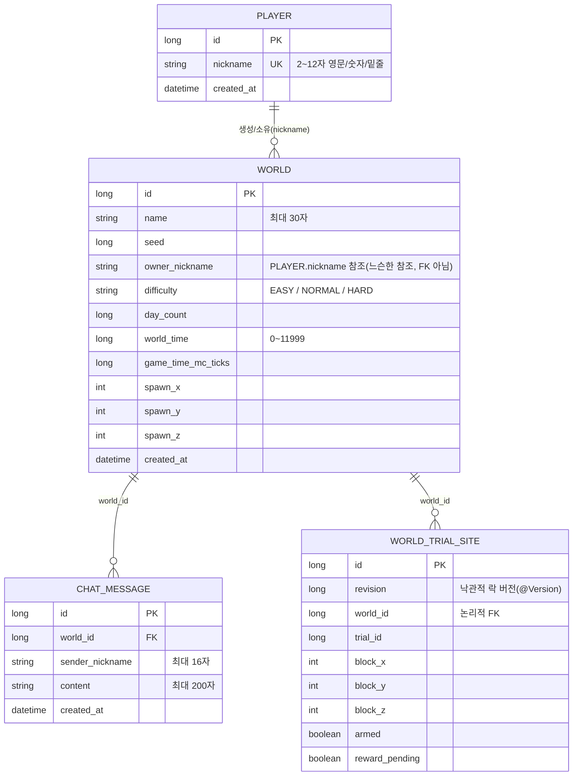

## ERD



- `CHAT_MESSAGE`는 `world_id + created_at` 복합 인덱스(`idx_chat_world_created_at`)를 가지고 있어, 월드별 최신순 조회와 커서 페이지네이션이 효율적으로 동작합니다.
- `WORLD_TRIAL_SITE`는 `world_id + trial_id`, `world_id + (block_x, block_y, block_z)`에 유니크 제약이 걸려 있고, `revision` 컬럼(JPA `@Version`)으로 낙관적 락을 적용해 동시 갱신 충돌을 방지합니다.
- `owner_nickname`은 JPA 연관관계(FK)가 아니라 `Player.nickname` 값을 그대로 저장하는 느슨한 참조입니다.

## REST API 명세

| Method | Path | 설명 | 요청 | 성공 응답 |
| --- | --- | --- | --- | --- |
| `POST` | `/players` | 플레이어 등록 | Body: `{ "nickname": string(2~12, `[A-Za-z0-9_]`) }` | `201 Created` (본문 없음) |
| `GET` | `/worlds` | 월드 목록 조회 (온라인 인원 수 포함) | - | `200 OK`: `[{ "id", "name", "seed", "onlineCount", "difficulty" }]` |
| `POST` | `/worlds` | 월드 생성 (기본 월드 최대 3개) | Body: `{ "name": string(1~30), "difficulty"?: EASY\|NORMAL\|HARD, "nickname"?: string(2~12), "debugSeed"?: long }` | `201 Created`: `{ "id", "name", "seed", "difficulty", "ownerNickname" }` |
| `DELETE` | `/worlds/{id}` | 월드 삭제 | Query: `nickname`(선택) | `204 No Content` |
| `DELETE` | `/worlds/{id}/if-matches` | 클라이언트가 알고 있는 상태와 서버 상태가 일치할 때만 삭제(조건부 삭제) | Query: `nickname`(선택) / Body: `{ "name", "seed", "difficulty": easy\|normal\|hard, "ownerNickname" }` | `204 No Content` |
| `GET` | `/worlds/{worldId}/chats` | 월드의 최근 채팅 N건 조회 (Redis 캐시-어사이드) | Query: `limit`(기본 50) | `200 OK`: `[{ "sender", "content", "createdAt" }]` |
| `GET` | `/worlds/{worldId}/chats/history` | 커서 기반 채팅 이력 조회(과거 방향 페이지네이션) | Query: `beforeCreatedAt`?, `beforeId`?, `limit`(기본 20) | `200 OK`: `{ "items": [{ "id", "sender", "content", "createdAt" }], "hasNext", "nextCreatedAt", "nextId" }` |
| `POST` | `/practice/worlds/{worldId}/chats/rollback` | (`assignment-checks` 프로필 전용) 저장 + 이벤트 발행 후 트랜잭션을 의도적으로 롤백하는 채점/검증용 엔드포인트 | Query: `nickname`, `content` | `204 No Content` |

## WebSocket API 명세

**연결**: `ws://{host}:{port}/ws/worlds/{worldId}?nickname={nickname}`

핸드셰이크 단계에서 다음을 검증하며, 실패 시 아래 코드로 연결이 종료됩니다.

| 코드 | 사유 |
| --- | --- |
| `4000` | `nickname` 누락 또는 등록되지 않은 플레이어 |
| `4001` | 존재하지 않는 월드(또는 하위 디멘션) |
| `4002` | 세션 등록 실패(예: 동일 닉네임 중복 접속) |
| `503`(핸드셰이크 응답) | 월드 베이스라인 초기화 중 |

### 클라이언트 → 서버

| type | 필드 | 설명 |
| --- | --- | --- |
| `chat` | `content`(string, 1~200자) | 채팅 전송. 플레이어당 10초에 5회로 레이트리밋(Redis Lua 스크립트로 원자적 처리) |
| `move` | `x`, `y`, `z`(number), `yaw`, `pitch`(number), `crouching`, `gliding`(boolean), `finalSceneActionId`?(string) | 이동/자세 갱신 |
| `onlineUsers` | - | 현재 월드 접속자 목록 요청 |
| `ping` | - | 하트비트(접속 유지) |

### 서버 → 클라이언트

| type | 필드 | 설명 |
| --- | --- | --- |
| `chat` | `sender`, `content`, `timestamp` | 같은 월드 전체에 브로드캐스트. 다중 서버 환경에서는 Redis Pub/Sub으로 다른 서버 인스턴스에도 릴레이되어, 그 서버에 접속한 클라이언트에게도 동일하게 전달됩니다. |
| `onlineUsers` | `users`(string[]), `count`(int) | 접속자 목록 응답(닉네임 오름차순 정렬) |
| `pong` | - | `ping`에 대한 응답 |
| `error` | `code` | 처리 실패. 예: `INVALID_JSON`, `INVALID_MESSAGE`, `UNKNOWN_TYPE`, `QUEUE_FULL`, `CHAT_COOLDOWN`, `INTERNAL_ERROR` |

## 실행 방법

### Docker Compose (멀티 인스턴스)

```bash
docker compose up -d --build
```

`mysql`, `redis`, `app-a`(8080), `app-b`(8081) 컨테이너가 함께 올라오며, 두 앱 인스턴스가 동일한 MySQL/Redis를 공유합니다.

